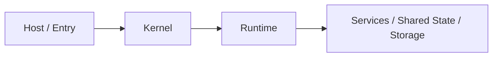
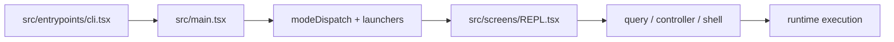
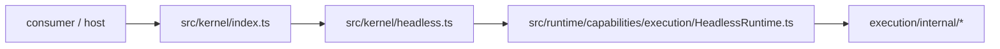
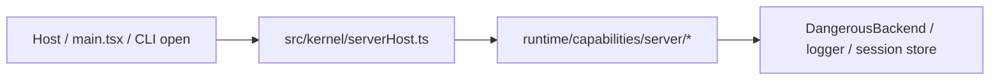
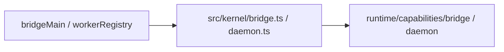

# 当前架构说明

本文描述的是 **当前代码基线** 的实际架构，不是历史结构，也不是未来规划。

相关文档：

- [kernelization-status.md](./kernelization-status.md)
- [main-entry-slimming-plan.md](./main-entry-slimming-plan.md)
- [../reference/environment-variables.md](../reference/environment-variables.md)

## 一句话概括

当前项目已经形成清晰的三层结构：

1. **Host / Entry**
   - CLI、REPL、bridge、daemon 这些宿主入口
2. **Kernel**
   - 面向宿主和外部 consumer 的稳定接入面
3. **Runtime**
   - 真正的能力实现层，包含 execution、server、bridge、daemon、mcp、tools 等

当前推荐的依赖方向是：

## 设计目标

当前架构的目标不是“弱化 CLI”，而是：

- 保持 CLI / REPL 作为官方交互宿主
- 让可复用能力沉到 `src/runtime`
- 让宿主和外部 consumer 优先通过 `src/kernel` 接入
- 让 package-level `./kernel` 成为唯一对外长期承诺的 kernel API

## 分层说明

### 1. Host / Entry 层

这一层负责：

- 进程入口
- 启动模式分发
- UI / TTY / signal / 宿主交互
- 把宿主参数和上下文接到 kernel

当前核心入口包括：

- `src/entrypoints/cli.tsx`
  - CLI 总入口
- `src/main.tsx`
  - 主启动装配与 mode dispatch
- `src/screens/REPL.tsx`
  - 官方交互式终端宿主
- `src/bridge/bridgeMain.ts`
  - bridge CLI 宿主
- `src/daemon/workerRegistry.ts`
  - daemon worker 宿主入口

这一层的原则是：

- **可以保留宿主特有 UI / TTY 逻辑**
- **不应该直接依赖 runtime 深路径实现**
- 优先通过 `src/kernel/*` 进入能力层

### 2. Kernel 层

这一层负责：

- 对外统一接入面
- 宿主侧轻编排
- 默认依赖装配
- 为外部 consumer 提供稳定入口

当前公开 root surface：

- `src/kernel/index.ts`
- `src/entrypoints/kernel.ts`
- package export: `@go-hare/hare-code/kernel`

当前 kernel 主要分为：

- `src/kernel/headless.ts`
- `src/kernel/headlessMcp.ts`
- `src/kernel/headlessStartup.ts`
- `src/kernel/serverHost.ts`
- `src/kernel/bridge.ts`
- `src/kernel/daemon.ts`

其中：

- `src/kernel/index.ts` 是 **唯一源码级公开 kernel surface**
- `@go-hare/hare-code/kernel` 是 **唯一 package-level 公开 kernel surface**
- `src/kernel/*` leaf 模块是 **host-internal surface**
  - 它们服务当前宿主接线
  - 不纳入对外 semver 承诺

### 3. Runtime 层

这一层负责：

- 执行核心
- 会话生命周期
- direct-connect / server runtime
- bridge / daemon capability
- MCP、tool、plugin、state provider、shared session core

核心目录：

- `src/runtime/capabilities/execution`
- `src/runtime/capabilities/server`
- `src/runtime/capabilities/bridge`
- `src/runtime/capabilities/daemon`
- `src/runtime/core`
- `src/runtime/contracts`

这一层是**内部能力层**，允许继续演进，不直接作为长期公开 API 承诺面。

## 当前主链

### CLI / Interactive 主链

当前 `main.tsx` 已经不再自己内联大块启动逻辑，而是：

- 用 `src/main/modeDispatch.ts` 决定启动模式
- 用 `src/hosts/cli/launchers/*` 承接 mode-specific launcher
- 用 `src/main/startupAssembly.ts` 承接共享启动装配

也就是说，`main.tsx` 现在更接近总入口，而不是实现中心。

### Headless / Kernel 嵌入主链

当前 headless 主链已经完成两件关键事：

1. `HeadlessRuntime` 不再回落到 `src/cli/print.ts`
2. headless 执行核心已经拆进 `execution/internal/*`

关键 internal seams 现在包括：

- `headlessSession.ts`
- `headlessSessionControl.ts`
- `headlessRuntimeLoop.ts`
- `headlessBootstrap.ts`
- `headlessControl.ts`
- `headlessStreaming.ts`
- `headlessPlugins.ts`
- `headlessMcp.ts`
- `headlessPostTurn.ts`

### Direct-connect / Server 主链

当前 `serverHost` 已经承担：

- direct-connect session 创建
- direct-connect connect + state apply
- server 默认装配
- headless connect client 入口

也就是说，宿主已经不再需要直接拼 `server/*` 历史兼容层。

### Bridge / Daemon 主链

当前 bridge/daemon 这条线已经把一批宿主编排上提到了 kernel，包括：

- bridge host assembly
- pointer refresh lifecycle
- stdin / signal / spawn-mode toggle
- resume / registration / reconnect failure mapping
- daemon worker deps 组装

所以 `bridgeMain.ts` / `workerRegistry.ts` 现在更接近宿主壳，而不是实现层中心。

## Shared Session Core

当前 shared session core 已经形成第一轮统一结构，但仍属于 runtime 内部能力，不是公开 API。

当前已存在的共享核心包括：

- `src/runtime/core/session/RuntimeSessionRegistry.ts`
- `src/runtime/contracts/session.ts`

server 和 execution/headless 已经开始共享：

- lifecycle seam
- index seam
- sink / attach seam
- runtime-owned registry

也就是说，现在 session 已不再完全是各能力域各自私有的局部对象。

## 当前稳定面

### 公开稳定面

当前可以对外长期承诺的只有：

- `@go-hare/hare-code/kernel`
- `src/kernel/index.ts` 对应的 root surface

当前 root surface 的稳定导出集合由测试锁定，包括：

- `createDefaultKernelHeadlessEnvironment`
- `createKernelHeadlessSession`
- `createKernelHeadlessStore`
- `runKernelHeadless`
- `connectDefaultKernelHeadlessMcp`
- `prepareKernelHeadlessStartup`
- `createDirectConnectSession`
- `createKernelSession`
- `connectDirectHostSession`
- `applyDirectConnectSessionState`
- `assembleServerHost`
- `getDirectConnectErrorMessage`
- `DirectConnectError`
- `runConnectHeadless`
- `runKernelHeadlessClient`
- `startServer`
- `startKernelServer`
- `connectResponseSchema`
- `runBridgeHeadless`
- `runDaemonWorker`

### 不承诺长期稳定的面

当前不建议对外直接依赖：

- `src/kernel/bridge.ts`
- `src/kernel/serverHost.ts`
- `src/kernel/daemon.ts`
- `src/runtime/*`
- `src/screens/REPL.tsx`
- `src/main.tsx`

原因很直接：这些文件仍承担宿主装配、兼容导出或内部实现职责，后续仍可能继续调整。

## 当前剩余工作

从架构角度看，当前已经不是“kernel 还没成型”，而是下面几类收尾：

1. **宿主继续瘦身**
   - `bridgeMain.ts`
   - `REPL.tsx`
   - `main.tsx` 的剩余零散装配

2. **runtime 内部继续纯化**
   - shared session core 更深 owner flush
   - runtime contracts 更完整覆盖

3. **发布面继续硬化**
   - root public surface 已冻结
   - leaf surface 暂不冻结

## 读代码建议

如果要快速理解当前架构，建议按这个顺序读：

1. `src/entrypoints/cli.tsx`
2. `src/main.tsx`
3. `src/main/modeDispatch.ts`
4. `src/main/startupAssembly.ts`
5. `src/kernel/index.ts`
6. `src/kernel/serverHost.ts`
7. `src/kernel/bridge.ts`
8. `src/runtime/capabilities/execution/HeadlessRuntime.ts`
9. `src/runtime/capabilities/server/*`
10. `src/runtime/core/session/*`

这样最容易建立“宿主 -> kernel -> runtime”的真实调用链心智模型。
