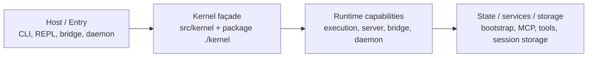
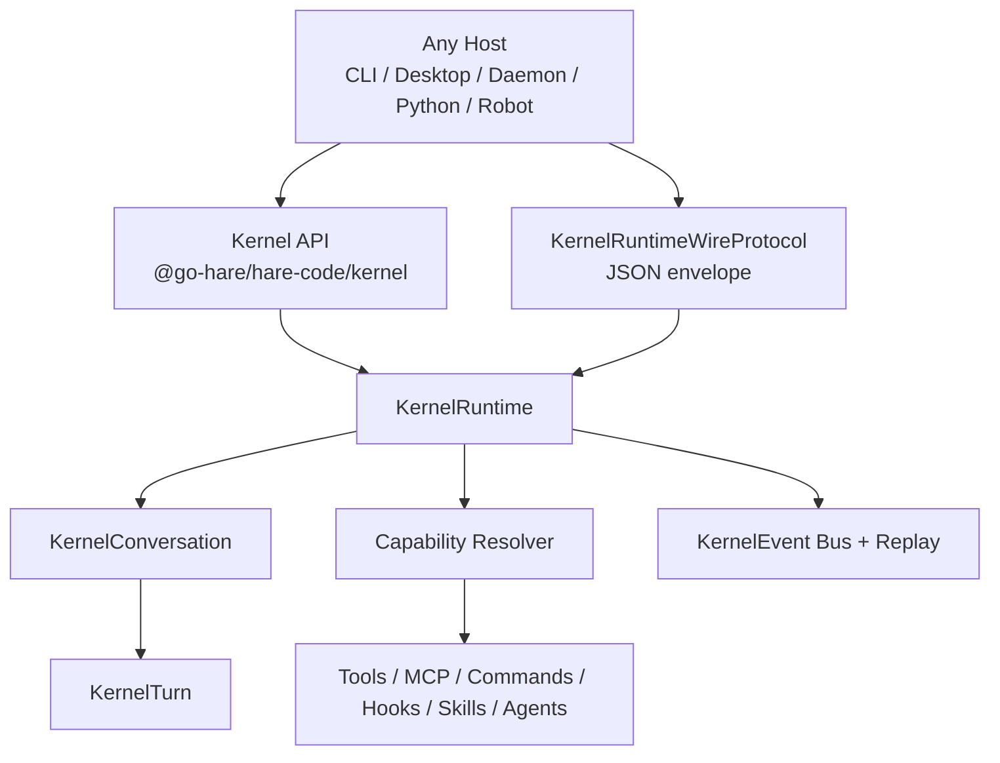

# Public Kernel 架构审查文档

日期：2026-04-26

2026-04-27 复核：本文保留 public runtime API 的审查结论，但内部 kernel
主链已经继续前进一轮。`SessionRuntime.submitRuntimeTurn(...)` 已成为
runtime-first turn stream，`RuntimeExecutionSession` 不再声明
`submitMessage(...)`，ACP prompt / bridge 直接消费 runtime envelope。
`createKernelRuntime()` 仍是下一阶段 public API 目标，不再作为内部 kernel
完整性的 blocker。

## 1. 审查结论

当前代码已经形成 `Host -> Kernel -> Runtime` 的主方向，且 `@go-hare/hare-code/kernel` 具备可发布、可导入、受测试锁定的 root surface。

但从完整 public kernel / runtime contract 的角度看，它仍处于“稳定 façade + runtime 下沉中”的阶段，还没有进入“完整 runtime contract 已建成”的阶段。

一句话判断：

> 现在的代码适合作为 public kernel 的收口起点，不适合作为完整多宿主 runtime contract 的最终形态。

架构上最强的部分：

- package-level kernel 入口已经明确。
- CLI headless/server/bridge/daemon 正在改道到 kernel。
- execution/server/bridge/daemon 的实现开始下沉到 `src/runtime`。
- session lifecycle、registry、state provider 已经出现第一轮 runtime seam。
- root surface 和 package smoke 已经有测试护栏。

架构上最大的剩余缺口：

- 还没有 `createKernelRuntime()` 总入口。
- `KernelRuntimeWireProtocol` 已有 internal command/router/NDJSON runner
  skeleton，并已进入 package public export/bin；router-level 长 turn
  executor streaming contract 与 process-isolated headless executor wiring 已
  落地；host reconnect/disconnect policy 与 opt-in process-level event
  replay journal 已落地；opt-in conversation snapshot journal 已能在 process
  hard kill 后恢复 latest snapshot、`detached` 状态和 active turn lock；
  public `KernelRuntimeWireClient` 与 `in-process` / `stdio` transport wrapper
  已落地，并已补齐 runtime-scoped `connect_host` replay、client-local live
  subscription scope、`sessionId`/`workspacePath` conversation reuse guard 与
  hard-kill 后 active model/tool execution durable resume。剩余缺口是 IPC /
  WebSocket / Unix socket 等非 NDJSON transport 实现。
- 统一 `KernelEvent` / envelope / replay 已有 internal event bus、
  router-level replay gap contract、compat projection 与 host event facade；
  headless、direct-connect、remote / SSH、bridge / RCS 与 ACP 已接入同源
  envelope。剩余缺口是把这套内部 event model 整理成更稳定的 public event
  object model。
- capability resolver 已有 internal lazy-loading skeleton，`create_conversation`
  已开始消费 `capabilityIntent` 并通过 `requireCapability(...)` demand-load；
  package declaration 已暴露 resolver injection type。剩余缺口是 headless
  eager assembly 还没有完全替换成 materialized capability object。
- permission 已有 runtime broker、headless wrapper、wire-level
  `decide_permission` command，以及 executor context 级共享
  `permissionBroker`；SDK stdio / structured IO 已经收敛到 broker-first
  compatibility adapter，外部 broker decision 可以直接 resolve pending
  request 并取消旧 stdio prompt；MCP `--permission-prompt-tool`、sandbox ask
  也已接入 broker-first glue；remote / direct-connect / SSH response 已补齐
  host 决策元数据，direct-connect 已能消费 `control_cancel_request` 清理
  stale prompt；ACP / bridge 旧 response 也已保留 host 决策分类，不再把
  bridge reject 记录成 abort；REPL local prompt queue 与 bridge remote
  permission source 已接入会话级 `RuntimePermissionBroker` compatibility
  adapter；`ToolUseContext.runtimePermission` 已把同一个 broker 下沉到
  `hasPermissionsToUseTool(...)`，ask pending request 与 allow / deny audit
  finalization 都在 permission evaluation 层发生；package-level
  `createKernelPermissionBroker(...)` 已把 public host decision surface
  正式化为可导入 facade。剩余是替换更多 legacy UI callback，而不是继续扩
  legacy callback。
- runtime state provider 仍大量代理 `bootstrap/state` singleton。
- headless / direct-connect / bridge 的 session 模型还没有统一成完整 conversation runtime。

## 2. 现有分层

当前代码的实际分层是：

### Host 层

Host 层负责启动模式、TTY/UI、signal、profile checkpoint、宿主状态写入。

已观察到的改道：

- `src/hosts/cli/launchers/headlessKernelDeps.ts` 只从 `../../../kernel/index.js` 取 headless kernel API。
- `src/hosts/cli/launchers/headlessLauncher.ts` 负责顺序编排 environment、MCP、startup、run，不再直接拼 runtime 深路径。

这说明 CLI host 已经开始按 kernel-first 接线。

### Kernel 层

`src/kernel/index.ts` 明确声明自己是唯一源码级 public kernel surface，package-level `./kernel` re-export 共享 semver 语义。

当前 root surface 包含：

- headless：`createDefaultKernelHeadlessEnvironment`、`runKernelHeadless`、`createKernelHeadlessSession`
- server/direct-connect：`createDirectConnectSession`、`connectDirectHostSession`、`assembleServerHost`
- bridge：`runBridgeHeadless`
- daemon：`runDaemonWorker`

这层现在更像 host-facing façade，而不是完整 runtime object model。

### Runtime 层

`src/runtime` 已经承载真实能力实现：

- `capabilities/execution`
- `capabilities/server`
- `capabilities/bridge`
- `capabilities/daemon`
- `core/state`
- `core/session`
- `contracts`

execution 的 `SessionRuntime` 已经显式表达“一 conversation 一个 runtime session，每次 `submitRuntimeTurn()` 是一个 turn”。server/direct-connect 已经有 `SessionManager`、`RuntimeDirectConnectSession`、`RuntimeSessionRegistry`。

这说明 runtime ownership 正在形成，但还没有统一成 public `KernelRuntime`。

## 3. 当前代码事实

### 3.1 Public package surface 已成立

证据：

- `src/kernel/index.ts` 只导出 root surface，并声明 leaf modules 不在 public semver 承诺内。
- `src/entrypoints/kernel.ts` 只 re-export `../kernel/index.js`。
- `package.json` 的 `./kernel` 指向 `./dist/kernel.js`。
- `src/kernel/__tests__/surface.test.ts` 锁定 exact export set。
- `tests/integration/kernel-package-smoke.test.ts` 用真实 npm pack + consumer import 验证 built package。

架构判断：

> root surface 可以作为 public kernel API 的冻结点；leaf module 不能冻结。

这点很关键。后续任何新能力都应该先进入 `src/kernel/index.ts` 的 contract 再进入 package surface，不能让外部 host 依赖 `src/kernel/*` leaf path。

### 3.2 Headless 入口是 façade，不是完整 controller

`src/kernel/headless.ts` 做了三件事：

- 构造 `AppState` store。
- 注入 MCP、commands、tools、agents、permission context。
- 调用 `runHeadlessRuntime(...)`。

它已经正确把 `agentDefinitions` 写入 AppState，避免下游 agent path 读不到 active agents。

但它还没有这些完整 contract：

- `KernelHeadlessController`
- `runTurn()`
- `abortTurn()`
- `onEvent()`
- 单 active turn lock
- event replay buffer
- public `KernelHeadlessEvent`

架构判断：

> 当前 headless surface 是“可运行 façade”，不是“完整 conversation controller”。

### 3.3 Execution runtime 已经有 conversation object 雏形

`SessionRuntime` 的注释和结构已经接近 conversation runtime：

- 一份 `mutableMessages`
- 一个 `abortController`
- 一份 read file cache
- `submitRuntimeTurn()` 表示 turn
- `stopAndWait()` 表示 lifecycle 终止

当前 source-level execution session 通过 `RuntimeConversation` /
`RuntimeTurnController` 与 wire active execution journal 承接 active turn /
abort 状态机；`interrupt()` / `resetAbortController()` 仍保留为本地
execution object 方法。public API 尚未把这套状态机整理成稳定的
`KernelConversation` / `KernelTurn` object model。

架构判断：

> execution runtime 已经能承载 conversation 语义，并已形成内部 runtime turn state machine；下一步缺的是 public object model，而不是内部主链能力。

完整状态还需要定义：

- `idle | running | aborting | completed | failed | disposed`
- duplicate `run_turn`
- duplicate `abort_turn`
- abort during tool
- abort after complete
- host disconnect：wire contract 已提供 `detach` / `continue` /
  `abort_active_turns`，仍需接入最终 conversation policy source。
- replay after reconnect：wire contract 已支持 `sinceEventId` 与 journal
  hydrate，`in-process` / `stdio` wrapper 已覆盖同一 host conversation
  contract；conversation snapshot journal 已覆盖 process restart 后的 active
  turn lock recovery；非 NDJSON transport 后续应只实现承载层，不新增私有
  schema。

### 3.4 Session core 已经出现，但语义还偏 lifecycle

`src/runtime/contracts/session.ts` 抽出了：

- `RuntimeSessionLifecycle`
- `RuntimeSessionSink`
- `AttachableRuntimeSession`
- `RuntimeSessionIndexStore`
- `IndexedRuntimeSession`

`RuntimeSessionRegistry` 提供：

- `add`
- `sync`
- `remove`
- `liveCount`

server/direct-connect 使用 `RuntimeManagedSession`，headless 也有 `HeadlessManagedSession`。

架构判断：

> shared session core 已经是 lifecycle seam，但还不是完整 conversation/session semantic core。

下一层应该补的是：

- conversation identity
- turn identity
- event identity
- permission request identity
- replay cursor
- capability scope
- workspace boundary

不要急着强行统一所有 transport；先统一 semantic identity。

### 3.5 Server/direct-connect 的 runtime 下沉质量较好

`kernel/serverHost.ts` 做默认装配：

- backend
- logger
- `SessionManager`
- config parse
- `startServerHost`

`SessionManager` 只依赖 server contracts 和 `RuntimeSessionRegistry`，不直接 new 具体 server 实现。`RuntimeDirectConnectSession` 实现 attach/detach/backlog/idle timeout/stop。

架构判断：

> server/direct-connect 是目前 runtime contract 化最扎实的一条线。

但它仍然不是完整 wire protocol：

- WebSocket message 仍是 direct-connect 私有输入输出。
- stdout line backlog 仍是 raw NDJSON compatibility backlog，不是
  最终 unified event store；但它已经能原样携带 `kernel_runtime_event`，且
  `RuntimeDirectConnectSession` 已提供 envelope sidecar backlog / replay
  facade，host 可以不再直接解析 raw stdout line。
- permission request 已通过 broker-first compatibility adapter 接入统一
  permission contract；direct-connect / remote / SSH 的外层 message schema
  仍是旧 transport 语义。当前 direct-connect / remote / SSH / bridge ingress
  已能识别 `kernel_runtime_event` 并进入 host-side runtime event sink；RCS
  bridge normalize / WS outbound / worker SSE path 也已把 `envelope` 作为
  first-class 字段保真传递。`@go-hare/hare-code/kernel` 已提供
  `createKernelRuntimeEventFacade(...)` 和 `kernel_runtime_event` wrapper
  encode / decode / consume helpers，host 可以统一 ingest / subscribe / replay。

### 3.6 State ownership 已开始拆，但 bootstrap singleton 仍是主风险

`createExecutionStateProviders()` 已经把 AppState provider 和 bootstrap provider 包起来。`bootstrapProvider.ts` 进一步把大量 `src/bootstrap/state.js` getter/setter 包成 `RuntimeBootstrapStateProvider`。

这是正确方向，但也暴露当前风险：

> runtime 仍然通过 provider 代理 process-global bootstrap state，多会话隔离不能只靠这个模型完成。

架构上必须继续把状态拆成：

- runtime-core state
- conversation state
- turn state
- host UI state
- process-global compatibility state

其中 process-global compatibility state 只能作为迁移适配层，不能成为最终 public runtime 的事实来源。

## 4. 完整 public kernel 目标状态

完整状态不是“headless 能跑”，而是：

必须具备：

- `createKernelRuntime(options)`
- `KernelRuntimeWireProtocol`
- `KernelRuntimeEnvelope`
- `KernelEvent`
- `KernelRuntimeCapabilities`
- `KernelConversation`
- `KernelTurn`
- `KernelPermissionBridge`
- `KernelToolCatalog`
- `KernelMcpManager`
- `KernelCommandRegistry`
- `KernelHookRegistry`
- `KernelSkillCatalog`
- `KernelPluginManager`
- `KernelAgentRegistry`
- `KernelSessionManager`

## 5. 架构缺口矩阵

| 领域 | 当前代码状态 | 完整状态要求 | 风险 |
| --- | --- | --- | --- |
| Root surface | 已有 `@go-hare/hare-code/kernel` | 承载完整 contract exports | 中 |
| Runtime 总入口 | 未见 public `createKernelRuntime()` | runtime object 统一生命周期 | 高 |
| Wire protocol | 已有 internal/router/client/export/bin 与 NDJSON/in-process/stdio transport | 扩展 IPC / WebSocket / Unix socket 等承载层 | 中 |
| Event surface | 已有 runtime envelope、event facade、compat projection 与多 host 接入 | public event object model 稳定化 | 中 |
| Headless | runtime-first 可运行 façade | public controller object + turn state machine | 中 |
| Server/direct-connect | contract 化较好 | 映射到统一 wire/event/permission | 中 |
| Session core | runtime conversation / turn controller 与 active execution journal 已有 | public conversation/turn object model | 中 |
| Permission | runtime broker 与 package-level broker facade 已有 | 替换更多 legacy UI callback | 中 |
| Capability | 分散加载 | resolver + descriptor + lazy loading | 高 |
| State ownership | provider seam 已有 | process-global singleton 退场 | 高 |
| Tests | surface/package/contract 已有 | wire/concurrency/security contract | 中 |

## 6. 架构原则

### 6.1 保留完整蓝图，不做 MVP 降级

实现可以分批，但 contract 不能按 MVP 裁掉能力域。

commands、tools、hooks、skills、plugins、MCP、agents、companion、Kairos、memory、sessions 都应进入完整 public kernel contract。

### 6.2 Public contract 只能从 root surface 出口进入

外部 consumer 只能依赖：

- `@go-hare/hare-code/kernel`

不能依赖：

- `src/runtime/*`
- `src/bootstrap/*`
- `src/screens/*`
- `src/commands/*`
- `src/utils/plugins/*`
- `src/skills/*`
- `src/kernel/*` leaf modules

### 6.3 先统一语义，再统一 transport

不要先把 server WebSocket、desktop worker IPC、stdio NDJSON、Python SDK callback 机械统一。

先统一这些语义：

- runtime id
- conversation id
- turn id
- event id
- permission request id
- capability descriptor
- workspace boundary
- host identity

transport 只是这些语义的承载方式。

### 6.4 Kernel 暴露行为协议，不暴露 UI

Public kernel 应暴露：

- 状态
- 能力
- 事件
- 决策请求
- 执行结果
- 错误
- replay cursor

不暴露：

- Ink component
- React object
- terminal layout
- shortcut state
- terminal menu state

### 6.5 Runtime state 不能长期依赖 bootstrap singleton

`bootstrapProvider` 是迁移期必要 seam，但不是最终状态。

最终应做到：

- runtime owns runtime state
- conversation owns conversation state
- host owns UI state
- bootstrap singleton 只保留 compatibility shell

## 7. 建议的架构收口顺序

这是完整状态的收口顺序，不是 MVP 范围裁剪。

1. 定义 `KernelRuntime` / `KernelConversation` / `KernelTurn` / `KernelEvent` / `KernelRuntimeEnvelope` 类型。
2. 建立 `createKernelRuntime()`，先复用现有 headless/server runtime，但不要把 API 设计成 headless-only。
3. 增加 wire protocol runner，支持 `init_runtime`、`create_conversation`、`run_turn`、`abort_turn`、`subscribe_events`、`ping`。
4. 把 `SessionRuntime` 包成 conversation object，补 active turn lock 和 abort 状态机。
5. 把 direct-connect / server 输出映射到 `KernelRuntimeEnvelope`，保留旧协议做 compatibility layer；当前旧 transport 已能承载并识别 `kernel_runtime_event`，direct-connect backlog 已有 envelope sidecar facade，RCS bridge schema / worker SSE 已保留 first-class envelope 字段，package-level event facade 已开放给 host 使用。
6. 抽 `KernelPermissionBridge`，统一 permission request/decision/timeout/audit；
   source-level broker 已经下沉到 `hasPermissionsToUseTool(...)`，package-level
   permission broker facade 已开放给 host。
7. 抽 `KernelRuntimeCapabilities` resolver，让 commands/tools/MCP/hooks/skills/plugins/agents 进入 descriptor + lazy loading。
8. 继续拆 `bootstrapProvider`，把 runtime-core / conversation / host state 分开。
9. 扩展测试：wire contract、event replay、abort race、multi conversation、permission timeout、package smoke。

当前 checkpoint：1、3、4、6、7 已有 internal skeleton 和定向测试，其中
wire runner 已覆盖 event replay、conversation snapshot recovery、多
conversation subscription isolation 与 session reuse guard；6 的 source-level
permission source of truth 和 package-level permission facade 已收口。后续
主要 integration 工作集中在 5、8、capability materialization 和 durable
execution resume。

## 8. 需要架构决策的点

### ADR-1：`KernelRuntime` 是 in-process object 还是必须 runner-first？

建议：两者都要，但 in-process API 是 source of semantics，runner 是 wire transport 实现。

### ADR-2：event ordering scope 是 runtime-wide 还是 conversation-local？

建议：conversation-local event id + runtime-wide sequence。这样 replay 和多会话隔离更清晰。

### ADR-3：permission 默认策略是什么？

建议：fail closed。timeout、host disconnect、unknown policy、schema mismatch 默认 deny 或 abort。

### ADR-4：capability disabled 时是空列表还是 unavailable error？

建议：descriptor 保留，调用返回 stable unavailable error。否则 host 无法区分“没有能力”和“能力加载失败”。

### ADR-5：desktop worker 是不是可以有私有协议？

建议：不可以。desktop worker 可以选择本地 IPC transport，但 schema 必须是 `KernelRuntimeWireProtocol`。

## 9. 验收标准

完整 public kernel 的架构验收不应只看 headless smoke，而要看以下门禁：

- package：`import('@go-hare/hare-code/kernel')` 后新增 contract exports 真实可用。
- wire：runner 能响应 `init_runtime` / `ping` / `create_conversation` / `run_turn` / `abort_turn` / `decide_permission`。
- event：所有 runtime event 都经 envelope 输出，并能 replay。
- concurrency：同一 conversation 单 active turn；不同 conversation 隔离。
- recovery：process restart 后 event replay、conversation snapshot、active turn
  lock 可恢复；active model/tool execution resume 需要单独 durable contract。
- abort：duplicate abort、abort during tool、abort after complete 都有稳定结果。
- permission：request/decision/timeout/deny/audit 都可观察，host decision 必须
  通过 `permissionRequestId` 进入 wire command。
- permission integration：in-process executor 必须通过
  `KernelRuntimeWireTurnExecutionContext.permissionBroker` 申请权限；SDK
  stdio / structured IO、MCP permission prompt、sandbox ask 已作为
  broker-first compatibility adapter；REPL local queue 与 bridge remote
  response 也已作为 adapter 进入 runtime broker；`hasPermissionsToUseTool`
  是 source-level 统一注册点，后续不允许再新增不可观察的 pending source of
  truth。
- security：host identity、workspace boundary、secret redaction、MCP/plugin trust 都有 contract。
- state：新增 runtime path 不直接读取 bootstrap singleton，必须走 provider 或 runtime-owned state。
- host isolation：desktop worker 只 import `@go-hare/hare-code/kernel`。

## 10. 最终判断

当前代码不是失败的架构，方向是正确的。

它已经完成了最难的第一步：从“宿主各自直连内部实现”转向“host 通过 kernel façade，runtime 承载能力实现”。

但架构师视角必须明确：

> 现在只能冻结 root surface，不能冻结完整 runtime contract。

下一阶段的核心不是继续加 façade，而是把 façade 背后的语义对象补齐：

- runtime
- conversation
- turn
- event
- permission
- capability
- security boundary

这些对象补齐后，`@go-hare/hare-code/kernel` 才能从“稳定入口”升级为“完整公共内核”。
