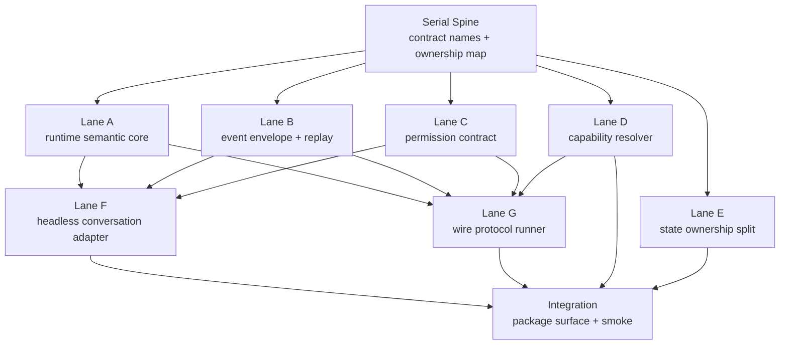

# Public Kernel 内部缺口并行补齐方案

日期：2026-04-27

## 1. 目标

这份文档回答一个执行问题：

> 在正式开发完整 public kernel 前，当前代码哪些内部缺口可以并行补齐，哪些必须串行收口？

本文不是 MVP 计划，也不是缩小 public kernel 蓝图。目标仍然是完整 public kernel / runtime contract。并行只是执行方式，不能改变最终能力范围。

当前判断：

- `@go-hare/hare-code/kernel` root surface 已经可以作为 public 入口冻结点。
- `src/kernel/*` leaf modules 仍是 host-internal surface。
- `src/runtime/*` 已经开始承载真实能力，但还缺完整 runtime semantics。
- 下一步应先补内部语义骨架，再扩大 public contract。

## 1.1 当前落地状态

截至 2026-04-27，本分支已经完成以下 internal 落点：

- Serial Spine 已落地到 `src/runtime/contracts/*`，包含 runtime、
  conversation、turn、event、capability、permission 的最小共享类型。
- Lane A 已落地到 `src/runtime/core/conversation/*` 与
  `src/runtime/core/turn/*`，包含单 conversation 单 active turn lock、
  duplicate run/abort、abort-before-start、abort-after-complete 和 dispose
  语义。
- Lane B 已落地到 `src/runtime/core/events/*`，包含统一
  `RuntimeEventBus`、runtime-wide `sequence`、conversation-local
  `eventId`、replay buffer、`expired` / `not_found` cursor 错误，以及
  JSON serializable payload 约束。
- Lane C 已落地到 `src/runtime/capabilities/permissions/*`，包含
  `RuntimePermissionBroker`、pending request registry、duplicate
  request/decision idempotency、timeout fail-closed、`allow_session` reuse、
  host disconnect deny 和 permission audit event。
- Lane C 的第一条 integration 已接到 headless `canUseTool` 创建点：
  `wrapCanUseToolWithRuntimePermissions` 包住既有 default / stdio /
  permission-prompt-tool 路径，只旁路生成 runtime permission request、
  decision 与 audit event，不改变原 permission 返回值。
- Headless runtime 已新增 `runtimeEventSink` observer seam：
  `createHeadlessPermissionRuntime` 把 `RuntimeEventBus` envelope 推给
  host-provided sink，当前覆盖 permission audit envelope；package-level
  `KernelHeadlessRunOptions` 声明也已补齐 `KernelRuntimeEventSink`，避免
  source surface 和 `./kernel` declaration 脱节。
- Lane C 的第二条 integration 已把 SDK stdio / structured permission prompt
  收敛到 broker-first path：`StructuredIO.createCanUseTool(...)` 可接收共享
  `RuntimePermissionBroker`，ask 决策先注册 `KernelPermissionRequest`，SDK
  `control_response`、PermissionRequest hook 和外部 broker decision 通过同一个
  `permissionRequestId` 竞速收口；外部 broker 决策赢时会发送
  `control_cancel_request` 取消旧 stdio prompt。
- Lane C 的第三条 integration 已把 MCP `--permission-prompt-tool` 与 sandbox
  network ask 接入 broker-first glue：MCP permission tool 结果会映射成
  `KernelPermissionDecision` 再映射回 legacy `PermissionDecision`；sandbox
  synthetic `can_use_tool` 复用缓存的 broker options，外部 broker 决策赢时同样
  取消旧 stdout prompt。remote / direct-connect / SSH permission response 已补齐
  `toolUseID` 与临时/永久/拒绝分类；direct-connect manager 已新增 pending
  request ledger 并处理 `control_cancel_request`，避免 stale UI prompt。
- Lane C 的第四条 integration 已把 REPL local permission queue 接入
  runtime broker：REPL 现在创建会话级 `RuntimePermissionBroker` 与
  `RuntimeEventBus`，`useCanUseTool(...)` 在 legacy allow / deny / ask
  路径上注册 `KernelPermissionRequest` 并把最终 `PermissionDecision`
  归一成 `KernelPermissionDecision`。bridge remote permission response 保持
  现有 transport / callback protocol 不变，但 allow / deny 结果会以
  `permissionRequestId = toolUseID`、`resolvedBy = repl_bridge_remote` 进入
  同一个 broker metadata，再映射回 legacy REPL 返回值。
- Lane C 的 source-level 收口已下沉到 `hasPermissionsToUseTool(...)`：
  `ToolUseContext.runtimePermission` 是 runtime broker 进入 legacy
  permission pipeline 的统一挂载点。REPL、SDK structured IO、headless
  control、wire executor 与 ACP session 都通过该 context 共享
  `RuntimePermissionBroker`；allow / deny 在 permission evaluation 层完成
  audit finalization，ask 在同一层注册 pending request，后续 host/UI 决策只
  负责推进同一个 `permissionRequestId`。旧 prompt UI、stdio
  `control_request`、bridge/direct-connect/remote/SSH response 仍保留为
  compatibility transport，不再自持独立 source of truth。
- Package-level permission facade 已进入 `@go-hare/hare-code/kernel`：
  `createKernelPermissionBroker(...)`、`KernelPermissionBroker`、
  `KernelPermissionBrokerOptions` 与 stable permission errors 让外部 host
  可以直接创建 runtime permission broker、提交 host decision、接收
  permission audit envelope，并复用 timeout fail-closed、`allow_session`
  grant、duplicate decision idempotency 和 host disconnect deny 语义。
- Headless stream-json verbose 输出已接入 runtime envelope：
  `kernel_runtime_event` SDK stdout message 包装 `KernelRuntimeEnvelopeBase`，
  目前输出 permission audit、conversation / turn lifecycle，以及
  `headless.sdk_message` envelope，同时保留外部 `runtimeEventSink`
  原始 envelope 观察能力；plain / json 输出不变。
- direct-connect / remote / SSH / bridge ingress 已能识别
  `kernel_runtime_event`：这些旧 transport 继续承载原有 `SDKMessage` 与
  `control_*` message，但 runtime envelope 会走独立 `onRuntimeEvent`
  callback / debug trace，不再落入旧 UI message adapter 或被当未知
  SDKMessage 丢弃。
- Package-level event facade 已进入 `@go-hare/hare-code/kernel`：
  `createKernelRuntimeEventFacade(...)`、`getKernelRuntimeEnvelopeFromMessage(...)`、
  `toKernelRuntimeEventMessage(...)`、`consumeKernelRuntimeEventMessage(...)`、
  `isKernelRuntimeEnvelope(...)` 与 `getKernelEventFromEnvelope(...)` 把
  compatibility `kernel_runtime_event` message、direct-connect sidecar
  envelope 和 internal `RuntimeEventBus` 统一成 host 可消费的 public event
  facade；该 facade 支持 emit、ingest、subscribe 与 scoped replay，headless
  internal stdout wrapper 也复用同一组 helper。
- RCS worker SSE 已补齐 runtime envelope preservation：`kernel_runtime_event`
  在 WS outbound、worker SSE `client_event`、route-level stream 中都保持
  `payload.envelope` first-class 字段，bare envelope / raw compatibility
  payload 不再被散成顶层字段。
- Lane D 的 internal resolver 骨架已落地到
  `src/runtime/capabilities/RuntimeCapabilityResolver.ts` 与
  `src/runtime/capabilities/defaultRuntimeCapabilities.ts`，包含完整
  descriptor set、dependency graph、lazy load hook、scoped reload、
  failed / disabled 可观察状态和 unavailable error；当前未新增 resolver
  runtime value export。
- Lane D 的 wire integration 已开始消费 `capabilityIntent`：
  `create_conversation` 会把 host intent 映射为 resolver
  `requireCapability(...)` 调用，并输出 `capabilities.required` runtime
  event；package declaration 也已暴露 `KernelRuntimeWireCapabilityResolver`
  注入点，避免 source/package 漂移。
- Headless eager `commands/tools/agents/sdkMcpConfigs` assembly 已改为 runtime
  materializer / runtime service：`headlessCapabilityMaterializer.ts` 负责
  commands/tools/agents materialization，`headlessRuntimeCapabilityBundle.ts`
  负责 commands/plugin refresh 与 plugin MCP diff，`RuntimeHeadlessMcpService`
  负责 SDK seed / dynamic MCP server / status / reconnect state。
- Interactive CLI 已开始吃同一套 internal materializer：
  `main/commandAssembly.ts` 的 command / agent resolution 进入
  `materializeRuntimeCommandAssembly(...)`，`REPL.tsx` 的 local tools 使用
  `materializeRuntimeToolSet(...)`，不再在 REPL 内直接调用 builtin tool
  catalog。
- Hook / plugin runtime service adapter 已落地：
  `RuntimeHookService` 包住 plugin hook reload / cache / count lifecycle，
  `RuntimePluginService` 包住 REPL 初始 plugin commands / agents / hooks /
  MCP / LSP materialization；`refreshActivePlugins(...)` 与
  `useManagePlugins(...)` 都通过 runtime service adapter 进入 hook/plugin
  capability ownership。
- Lane F 的第一段 headless conversation adapter 已落地到
  `src/runtime/capabilities/execution/internal/headlessConversationAdapter.ts`：
  headless session 现在复用 `RuntimeConversation` 与同一个
  `RuntimeEventBus`，turn start / abort request / completed / failed 与
  conversation ready / disposed 会输出 runtime envelope；permission audit
  event 也复用该 event bus。`createHeadlessConversation(...)` internal
  object API 已提供 `runTurn()`、`abortActiveTurn()`、`completeTurn()` 与
  `failTurn()`；SDK control `interrupt`、`end_session` 和 bridge interrupt
  已显式接到 active runtime turn abort。当前仍未扩大 package public
  surface。
- Lane G 的第一段 internal wire protocol skeleton 已落地到
  `src/runtime/contracts/wire.ts` 与 `src/runtime/core/wire/*`：当前已有
  `KernelRuntimeCommand` union、`abort_turn` command、NDJSON command line
  parser、envelope serializer、schema mismatch error mapping，以及
  `KernelRuntimeWireRouter` 对 `ping / init_runtime / create_conversation /
  run_turn / abort_turn / dispose_conversation / subscribe_events` 的内部路由。
  该 router 通过注入 `createHeadlessConversation(...)` 复用 Lane F 的
  conversation/turn state machine，并共享同一个 `RuntimeEventBus` 做
  replay 与 monotonic sequence。`src/kernel/wireProtocol.ts` 已提供 kernel
  leaf assembly，`src/entrypoints/kernel-runtime.ts` 已能作为 source-level
  NDJSON runner 启动；`reload_capabilities` 已接入
  `RuntimeCapabilityResolver`，`publish_host_event` 已接入共享
  `RuntimeEventBus`。`subscribe_events` 的 router-level replay contract 已覆盖
  scoped `sinceEventId`、missing cursor `not_found`、expired cursor
  `unavailable/retryable`，并保证 replay 失败前不发 subscription ack。
  `run_turn` 已支持注入 `runTurnExecutor` 作为长 turn 执行契约：ack 仍立即返回
  running snapshot，executor 后台通过统一 event bus 输出 `turn.output_delta`、
  `turn.completed` 或 `turn.failed`，`abort_turn` 会同步触发执行信号 abort。
  默认 runner 已新增进程隔离的真实 headless executor wiring：
  `KernelRuntimeHeadlessProcessExecutor` 通过现有 headless `-p
  --output-format stream-json --verbose` 子进程复用完整 CLI/headless 能力，
  并把 SDK stdout message 归一化为 `headless.sdk_message`、
  `turn.output_delta` 与 terminal turn event；`kernel-runtime` 可通过
  `HARE_KERNEL_RUNTIME_HEADLESS_EXECUTOR=process` 打开这条路径。
  `@go-hare/hare-code/kernel` 已导出 `runKernelRuntimeWireProtocol()`、
  `createDefaultKernelRuntimeWireRouter()` 与
  `KERNEL_RUNTIME_COMMAND_SCHEMA_VERSION`，`package.json` 已新增
  `hare-kernel-runtime` bin 指向 `dist/kernel-runtime.js`。
  `connect_host` replay 已收缩为 runtime-scoped events，conversation replay
  统一经 `subscribe_events`；`in-process` / `stdio` transport wrapper 已维护
  client-local live subscription scope，订阅某个 conversation 后不会继续收到
  其它 conversation 的 live events；`create_conversation` 已拒绝同
  `conversationId` 下不同 `sessionId` / `workspacePath` 的复用，snapshot
  recovery 遇到 `sessionId` 不匹配时会跳过旧记录。

尚未完成的 Lane B integration：

- headless stream-json verbose 已双写 `headless.sdk_message` runtime
  envelope；旧 `SDKMessage` 输出仍保留为 compatibility stream。尚未把所有
  SDK message 类型替换成只通过 unified `KernelEvent` 语义输出。
- direct-connect backlog 仍保存 raw NDJSON line 作为 compatibility replay；
  同时已新增 `RuntimeDirectConnectSession.getRuntimeEnvelopeBacklog()` /
  `replayRuntimeEnvelopeBacklog(...)` sidecar facade，能从 raw line 中索引
  `kernel_runtime_event` envelope，host 不再只能重新解析 stdout backlog。
- bridge / remote / direct-connect / SSH ingress 已接入
  `kernel_runtime_event` adapter；RCS bridge schema 仍保留旧 `SDKMessage` /
  `control_*` compatibility schema，但 `kernel_runtime_event` 已作为
  first-class envelope payload 在 normalize、WS outbound path 与 worker SSE
  `client_event` 中保真传递。
- direct-connect / bridge 的 runtime event 输出已有 package-level unified
  event facade，可被 host 统一 ingest / subscribe / replay；后续剩余是把更多
  host 调用点显式改成使用该 facade，而不是只暴露 helper。

尚未完成的 Lane C integration：

- `decide_permission` wire command 已进入 `KernelRuntimeWireProtocol`，默认
  runner 创建共享 `RuntimePermissionBroker`，host 可通过
  `KernelRuntimeWireClient.decidePermission(...)` 按 `permissionRequestId`
  提交 `allow_once / allow_session / deny / abort` 等决策；未知 request id
  返回 `not_found`。
- `runTurnExecutor` 已通过 `KernelRuntimeWireTurnExecutionContext` 拿到同一
  个 `RuntimePermissionBroker`；in-process executor 发起的 pending
  permission request 可以直接由外部 `decide_permission` 推进，不再需要
  executor 自己拼一套 pending map。
- `RuntimePermissionBroker` 已通过 `ToolUseContext.runtimePermission` 下沉到
  `hasPermissionsToUseTool` 内部；旧 REPL 仍以 legacy `PermissionDecision`
  作为本地执行返回格式，但 pending request、allow / deny finalization 与
  bridge remote response 都已经通过统一 broker source of truth 记录。
- SDK stdio / structured permission prompt 已经是 broker-first
  compatibility adapter：legacy `PermissionDecision` 只作为返回格式，source
  of truth 是共享 `RuntimePermissionBroker`；`sendRequest()` 已先注册 pending
  request 再写 outbound，避免 host response 早于 pending map 的竞态。
- MCP `--permission-prompt-tool` 与 sandbox network ask 已经接入
  broker-first compatibility adapter；旧 MCP / stdout 协议保持不变。
- remote / direct-connect / SSH permission response 已补齐
  `toolUseID` 与 decision classification；direct-connect manager 已补
  requestId -> permission request ledger 和 cancel callback。
- package-level `createKernelPermissionBroker(...)` 已把 public host decision
  surface 正式化为可导入 facade；尚未完全替换 REPL permission prompt queue
  UI，当前策略是保留现有 UI 与
  callback 语义，只把 permission source of truth 旁路收敛到 runtime broker。
- ACP / bridge response path 已补齐 `toolUseID` 与临时/永久/拒绝分类，
  bridge remote reject 不再走 abort 型 ask；REPL local queue 与 bridge remote
  permission source 已接入 broker-first compatibility adapter。ACP session
  现在也给 `QueryEngine` 注入会话级 `ToolUseContext.runtimePermission`，避免
  ACP path 绕过统一 permission source。

尚未完成的 Lane G integration：

- 当前 router 支持多 conversation map、单 conversation busy guard、host
  connect/reconnect/disconnect policy，以及 opt-in event journal 的进程重启后
  replayable event recovery；同时已接入 opt-in conversation snapshot journal，
  能在 `kernel-runtime` 进程 hard kill 后按 `conversationId` 恢复 latest
  conversation snapshot，把 crash 前 active conversation 归一化为 `detached`，
  并保留 active turn lock。
- multi transport wrapper 已完成第一层：public `KernelRuntimeWireClient`
  统一 requestId、ack/error/pong 关联与 scoped event fan-out；`in-process` /
  `stdio` transport 共用同一 host conversation contract，并维护
  client-local live subscription scope。
- 尚未完成 process crash 后 active model/tool execution 的 durable resume；当前
  journal 只保证 public event replay 与 conversation / active turn state
  recovery，不恢复正在运行的 tool 或模型流。

## 2. 并行原则

### 2.1 可以并行的条件

一个任务 lane 适合并行，必须同时满足：

- 写入边界清楚。
- 不抢同一个 shared contract 文件。
- 可以独立写测试。
- 不要求其它 lane 先完成才能编译。
- 产物可以先停留在 runtime/internal 层，不急着进入 public export。

### 2.2 不适合并行的区域

以下区域必须串行处理，或由 integration owner 统一收口：

- `src/kernel/index.ts`
- `src/kernel/index.d.ts`
- `src/entrypoints/kernel.ts`
- `package.json` exports
- `src/runtime/contracts/index.ts`
- public `KernelRuntime*` 命名和字段 schema
- wire envelope schema
- root-level package smoke expected export set

原因：这些文件和 contract 一旦多人同时改，容易造成 public surface 震荡和测试冲突。

## 3. 总体依赖图



## 4. Serial Spine：先定共享骨架

这一段必须单线程完成，不能并行抢改。

### 4.1 写入范围

- `src/runtime/contracts/runtime.ts`
- `src/runtime/contracts/conversation.ts`
- `src/runtime/contracts/turn.ts`
- `src/runtime/contracts/events.ts`
- `src/runtime/contracts/capability.ts`
- `src/runtime/contracts/permissions.ts`
- `src/runtime/contracts/index.ts`

如果这些文件不存在，就先新增；如果已有同名文件，则只做最小骨架，不接实现。

### 4.2 产物

只定义命名和最小共享类型：

- `KernelRuntimeId`
- `KernelConversationId`
- `KernelTurnId`
- `KernelEventId`
- `KernelPermissionRequestId`
- `KernelRuntimeState`
- `KernelConversationState`
- `KernelTurnState`
- `KernelRuntimeEnvelopeBase`
- `KernelEvent`
- `KernelCapabilityDescriptor`
- `KernelPermissionRequest`
- `KernelPermissionDecision`

### 4.3 验收

- `bun run typecheck`
- 新增 contract-only test，验证这些类型文件不 import host/UI/CLI 模块。

## 5. Lane A：Runtime Semantic Core

目标：把 runtime / conversation / turn 的语义补出来，但先不暴露 package public API。

### 5.1 写入范围

- `src/runtime/core/runtime/*`
- `src/runtime/core/conversation/*`
- `src/runtime/core/turn/*`
- `src/runtime/contracts/runtime.ts`
- `src/runtime/contracts/conversation.ts`
- `src/runtime/contracts/turn.ts`

### 5.2 只读范围

- `src/runtime/capabilities/execution/SessionRuntime.ts`
- `src/runtime/capabilities/execution/internal/headlessManagedSession.ts`
- `src/runtime/contracts/session.ts`
- `src/runtime/core/session/RuntimeSessionRegistry.ts`

### 5.3 产物

- `RuntimeConversation` 内部接口。
- `RuntimeTurnController` 内部接口。
- 单 conversation 单 active turn lock。
- turn lifecycle 状态机：
  - `idle`
  - `starting`
  - `running`
  - `aborting`
  - `completed`
  - `failed`
  - `disposed`
- duplicate `runTurn` / duplicate `abortTurn` 的内部语义。

### 5.4 不做

- 不改 `@go-hare/hare-code/kernel` public export。
- 不接 desktop worker。
- 不改 direct-connect 外部协议。

### 5.5 验收

- `bun test src/runtime/core`
- `bun test src/runtime/capabilities/execution/__tests__`
- `bun run typecheck`

## 6. Lane B：Event Envelope 与 Replay

目标：建立统一事件 envelope 和 replay buffer，先作为 runtime internal event bus。

### 6.1 写入范围

- `src/runtime/core/events/*`
- `src/runtime/contracts/events.ts`
- `src/runtime/capabilities/execution/internal/headlessStreamEmission.ts`
- `src/runtime/capabilities/server/RuntimeDirectConnectSession.ts`

### 6.2 只读范围

- `src/entrypoints/sdk/controlTypes.ts`
- `src/runtime/capabilities/server/HostRuntime.ts`
- `src/runtime/capabilities/bridge/*`

### 6.3 产物

- `KernelRuntimeEnvelopeBase`
- `KernelRuntimeErrorPayload`
- `RuntimeEventBus`
- package-level `createKernelRuntimeEventFacade`
- conversation-local `eventId`
- runtime-wide `sequence`
- replay buffer
- replay gap / expired / unavailable error。
- headless `kernel_runtime_event` stdout wrapper。
- transport ingress `kernel_runtime_event` adapter。

### 6.4 不做

- 不替换所有 SDK message。
- 不删除 direct-connect stdout line backlog。
- 不替换旧 bridge event schema，只在 compatibility schema 中保留
  first-class `kernel_runtime_event.envelope`。

### 6.5 验收

- event ordering test。
- replay since-event-id test。
- event payload JSON serializable test。
- headless SDK message -> runtime envelope test。
- direct-connect raw backlog -> runtime envelope sidecar replay test。
- direct-connect / remote / SSH / bridge ingress runtime envelope routing test。
- RCS normalize / WS outbound `kernel_runtime_event.envelope` preservation test。
- RCS worker SSE `kernel_runtime_event.envelope` preservation test。
- package-level event facade import / emit / ingest / replay test。
- `bun run typecheck`

## 7. Lane C：Permission Contract

目标：把 permission 从 UI callback / SDK control 语义提升成 runtime decision contract。

### 7.1 写入范围

- `src/runtime/contracts/permissions.ts`
- `src/runtime/capabilities/permissions/*`
- `src/types/runtimePermission.ts`
- `src/utils/permissions/runtimePermission*.ts`
- `src/utils/permissions/permissions.ts`
- `src/runtime/capabilities/tools/ToolPolicy.ts`
- `src/runtime/capabilities/tools/ToolCatalog.ts`

### 7.2 只读范围

- `src/hooks/useCanUseTool.ts`
- `src/entrypoints/agentSdkTypes.ts`
- `src/runtime/capabilities/execution/SessionRuntime.ts`

### 7.3 产物

- `KernelPermissionRequest`
- `KernelPermissionDecision`
- request id 绑定。
- timeout 默认 deny / abort。
- `allow_once` / `allow_session` / `deny` / `abort` 语义。
- permission audit event。
- host disconnect 后 fail closed。
- wire-level `decide_permission` command。
- `ToolUseContext.runtimePermission` 作为 legacy pipeline 的统一 broker
  context。
- `hasPermissionsToUseTool(...)` 注册 ask pending request，并 finalize
  allow / deny audit。
- REPL / SDK / headless / ACP host 入口只负责注入 broker context，不再各自
  持有 permission source of truth。

### 7.4 不做

- 不重写 permission UI。
- 不改变现有 CLI prompt 体验。
- 不直接扩大 bypass permissions 语义。

### 7.5 验收

- permission timeout test。
- deny/audit event test。
- duplicate decision idempotency test。
- wire-level decision ack / missing request `not_found` test。
- source-level `hasPermissionsToUseTool` pending/finalization test。
- REPL compatibility adapter metadata preservation test。
- `bun run typecheck`

## 8. Lane D：Capability Resolver

目标：把 commands/tools/MCP/hooks/skills/plugins/agents 从散装加载收敛成 runtime capability graph。

### 8.1 写入范围

- `src/runtime/contracts/capability.ts`
- `src/runtime/capabilities/index.ts`
- `src/runtime/capabilities/commands/*`
- `src/runtime/capabilities/tools/*`
- `src/runtime/capabilities/mcp/*`

### 8.2 只读范围

- `src/commands.ts`
- `src/tools.ts`
- `src/utils/plugins/*`
- `src/services/mcp/*`
- `packages/builtin-tools/src/tools/AgentTool/*`

### 8.3 产物

- `KernelCapabilityDescriptor`
- status：
  - `declared`
  - `loading`
  - `ready`
  - `degraded`
  - `failed`
  - `disabled`
- dependency graph。
- lazy loading hook。
- scoped reload。
- unavailable error。

当前状态：

- `RuntimeCapabilityResolver` 已提供 `listDescriptors()`、
  `requireCapability()`、`loadCapability()` 与 `reloadCapabilities()`。
- 默认 capability graph 已声明 commands、tools、MCP、hooks、skills、
  plugins、agents、companion、Kairos、memory、sessions 等完整能力族。
- commands / tools / MCP 仍通过 lazy loader 复用现有内部 loader，未把
  resolver 暴露到 package public surface。
- commands / tools 已有 shared materializer 被 headless 与 interactive CLI
  共同使用；hooks / plugins 已有 runtime service adapter；MCP 的 headless
  lifecycle 已进入 `RuntimeHeadlessMcpService`，interactive MCP config
  loading、pending reconciliation、stale cleanup、two-phase connect、manual
  reconnect、enable / disable、automatic reconnect、channel notification
  handler 注册 / 卸载与 `tools/prompts/resources list_changed` refresh 已进入
  `RuntimeInteractiveMcpService`。`useManageMCPConnections(...)` 仍作为
  compatibility UI adapter 保留 AppState batching、elicitation UI 写入、
  channel message 入队、channel permission resolve 与 blocked toast callback。

### 8.4 不做

- 不一次性重写所有 commands / tools / MCP loader。
- 不把 capability resolver 直接暴露到 package public surface。
- 不删除现有 CLI loader。

### 8.5 验收

- descriptor snapshot test。
- failed capability visible test。
- disabled capability returns unavailable test。
- lazy load does not import UI test。
- `bun run typecheck`

## 9. Lane E：State Ownership Split

目标：继续把 process-global `bootstrap/state` 从 runtime 事实来源降级为 compatibility adapter。

### 9.1 写入范围

- `src/runtime/core/state/*`
- `src/runtime/contracts/state.ts`
- `src/runtime/capabilities/execution/SessionRuntime.ts`
- `src/runtime/capabilities/execution/internal/headlessBootstrap.ts`

### 9.2 只读范围

- `src/bootstrap/state.ts`
- `src/state/AppStateStore.ts`
- `src/state/AppState.tsx`
- `src/runtime/core/state/ownership.ts`

### 9.3 产物

- conversation-owned state slice。
- turn-owned state slice。
- runtime-owned identity state。
- host-owned UI state 标注。
- 新 runtime path 禁止直接 import `src/bootstrap/state.js`。

### 9.4 不做

- 不一次性删除 bootstrap singleton。
- 不重构 REPL UI state。
- 不改变当前 session resume 行为。

### 9.5 验收

- import discipline test。
- runtime state provider test。
- multi conversation state isolation test。
- `bun run typecheck`

## 10. Lane F：Headless Conversation Adapter

目标：把现有 headless façade 包到 conversation / turn / event / permission 语义上。

### 10.1 依赖

依赖 Lane A、Lane B、Lane C 的内部 contract。

### 10.2 写入范围

- `src/kernel/headless.ts`
- `src/runtime/capabilities/execution/HeadlessRuntime.ts`
- `src/runtime/capabilities/execution/internal/headlessSession.ts`
- `src/runtime/capabilities/execution/internal/headlessRuntimeLoop.ts`
- `src/runtime/capabilities/execution/internal/headlessControl.ts`

### 10.3 产物

- internal `createHeadlessConversation(...)`。
- `runTurn(...)` adapter。
- `abortTurn(...)` adapter。
- headless event emission。
- active turn lock 接入。

当前状态：

- `HeadlessConversationAdapter` 已接入 `RuntimeConversation`。
- `createHeadlessConversation(...)` 已提供 internal object API。
- `headlessRuntimeLoop` 每个 prompt batch 会创建 runtime turn，并在
  abort controller 或 control interrupt 触发时记录 `turn.abort_requested`。
- turn 正常完成、error result、异常失败都会产生稳定 runtime turn
  envelope。
- `createHeadlessPermissionRuntime` 已支持注入共享 `RuntimeEventBus`，
  避免 permission audit event 和 turn event 分裂成两套 runtime stream。

剩余缺口：

- 尚未把 SDK control `interrupt` 明确建模成 public wire-level
  `abort_turn` command。
- 尚未实现 multi-conversation headless host；当前 conversation id 仍复用
  session id。

### 10.4 不做

- 不先扩 `src/kernel/index.ts`。
- 不改 package smoke expected exports。
- 不引入 desktop worker 协议。

### 10.5 验收

- `bun test src/kernel/__tests__/headless.test.ts`
- `bun test tests/integration/kernel-headless-smoke.test.ts`
- abort race focused tests。
- `bun run typecheck`

## 11. Lane G：Wire Protocol Runner

目标：新增常驻 runtime runner，但先接 internal runtime semantics，不急着承诺完整 package API。

### 11.1 依赖

依赖 Lane A、Lane B、Lane C、Lane D 的 contract。

### 11.2 写入范围

- `src/kernel/wireProtocol.ts`
- `src/entrypoints/kernel-runtime.ts`
- `src/runtime/core/wire/*`
- `tests/integration/kernel-runtime-wire-smoke.test.ts`

### 11.3 产物

已完成：

- `src/runtime/contracts/wire.ts` 定义 internal `KernelRuntimeCommand`
  union，包含 `abort_turn`。
- `src/runtime/core/wire/KernelRuntimeWireCodec.ts` 支持 command line parse、
  envelope serialization 与 schema mismatch parse error。
- `src/runtime/core/wire/KernelRuntimeWireRouter.ts` 支持
  `init_runtime`、`create_conversation`、`run_turn`、`abort_turn`、
  `dispose_conversation`、`subscribe_events`、`ping`。
- `src/kernel/wireProtocol.ts` 组装默认 headless-backed router，并提供
  public `runKernelRuntimeWireProtocol()` 与
  `createDefaultKernelRuntimeWireRouter()`。
- `src/entrypoints/kernel-runtime.ts` 支持 stdin/stdout NDJSON runner；
  `build.ts` 已生成可执行 `dist/kernel-runtime.js`，`package.json` 已新增
  `hare-kernel-runtime` bin。
- `subscribe_events` 复用 `RuntimeEventBus.replay()`，能按
  `conversationId / turnId / sinceEventId` 返回 replay envelope。
- `subscribe_events` 已覆盖 missing cursor 与 expired cursor：missing 返回
  `not_found`，expired 返回 `unavailable` 且 `retryable: true`；两种失败都不
  先发 subscription ack。
- `reload_capabilities` 复用 Lane D 的 `RuntimeCapabilityResolver`，返回
  descriptor set 并产生 `capabilities.reloaded` runtime event。
- `publish_host_event` 进入共享 `RuntimeEventBus`，可被
  `subscribe_events` replay。
- `connect_host` / `disconnect_host` 已进入 wire contract。`connect_host`
  可携带 `sinceEventId`，返回 cursor 之后的 replay envelope，并产生
  `host.connected` / `host.reconnected` replayable event；`disconnect_host`
  默认 `detach`，也支持 `continue` 与 `abort_active_turns` policy，并产生
  `host.disconnected` replayable event。
- `run_turn` 可注入 `runTurnExecutor` 并后台流式输出
  `turn.output_delta`、`turn.completed` 与 `turn.failed`；executor 异常会进入
  failed turn，executor 自然结束会补 `end_turn` completion。
- `abort_turn` 会触发 active executor 的 `AbortSignal`，并保持 turn controller
  的最终 stop reason。
- `KernelRuntimeHeadlessProcessExecutor` 已把默认真实 headless 执行接到
  process-isolated CLI/headless 子进程，子进程 stdout SDK message 会进入
  `headless.sdk_message`、`turn.output_delta` 和 terminal turn event。
- concurrent `run_turn` 返回 `busy`，missing conversation 返回 `not_found`，
  malformed wire message 返回 `schema_mismatch`。
- `decide_permission` 已接入 runtime permission broker；pending request 可由
  host decision resolve，重复 decision 保持 broker idempotency，missing
  request 返回 `not_found`。
- `KernelRuntimeWireTurnExecutionContext.permissionBroker` 已进入 router
  contract；`src/runtime/core/wire/__tests__/KernelRuntimeWireRouter.test.ts`
  覆盖 executor 发起 pending request、host 用 `decide_permission`
  推进执行的完整路径。
- SDK stdio permission prompt 已接到同一个 broker-first contract；
  `src/runtime/capabilities/execution/internal/io/__tests__/structuredIO.permissionFlow.test.ts`
  覆盖 stdin allow/deny、bridge 注入 response、duplicate response 忽略，以及
  broker 外部 decision 直接 resolve pending request 并取消 host prompt；同文件也
  覆盖 sandbox broker-first path。
- `src/server/__tests__/directConnectManager.test.ts` 覆盖 direct-connect
  permission response 元数据保留，以及 `control_cancel_request` 清理 pending
  prompt。
- `src/remote/__tests__/RemoteSessionManager.test.ts` 覆盖 remote permission
  response 自动补齐 `toolUseID` 和 decision classification。
- `src/hooks/toolPermission/__tests__/runtimePermissionBroker.test.ts` 覆盖
  REPL permission compatibility adapter 把 bridge allow / deny response
  归一进 `RuntimePermissionBroker`，并保留 `toolUseID` 与
  `decisionClassification`。
- `tests/integration/kernel-runtime-wire-smoke.test.ts` 已通过子进程
  stdin/stdout 验证 ping/create/run/abort/replay/reload/publish。
- `tests/integration/kernel-runtime-wire-smoke.test.ts` 已覆盖
  `HARE_KERNEL_RUNTIME_HEADLESS_EXECUTOR=process` 下的 runner-level
  process-backed executor 输出。
- `RuntimeEventBus` 支持从 replayable envelope hydrate replay buffer；
  `RuntimeEventFileJournal` 支持 NDJSON 持久化 replayable events；默认
  runner 可通过 `HARE_KERNEL_RUNTIME_EVENT_JOURNAL=<path>` 或
  `eventJournalPath` 进行 process-level event replay recovery。
- `tests/integration/kernel-runtime-wire-smoke.test.ts` 已覆盖 journal 文件跨
  `kernel-runtime` 进程重启后的 `subscribe_events` replay。
- `RuntimeConversationSnapshotJournal` 支持 NDJSON 持久化 latest conversation
  snapshot；默认 runner 可通过
  `HARE_KERNEL_RUNTIME_CONVERSATION_JOURNAL=<path>` 或
  `conversationJournalPath` 进行 process-level conversation snapshot recovery。
- `tests/integration/kernel-runtime-wire-crash-recovery.test.ts` 已覆盖
  `kernel-runtime` hard kill 后 replayable events 可 replay，且重新
  `create_conversation` 可恢复 `detached` conversation snapshot 与 active turn
  lock；后续 `run_turn` 返回 `busy`，host 可用 `abort_turn` 清理旧 active
  turn。
- `KernelRuntimeWireClient` 已提供 host-side wrapper，避免 desktop / worker
  自己拼 NDJSON、自己管理 `requestId`、自己关联 ack/error/pong。
- `KernelRuntimeWireClient.decidePermission()` 已进入 host-side wrapper，并在
  cross-transport contract 中覆盖 missing permission `not_found` 行为。
- `hasPermissionsToUseTool(...)` 已成为 source-level permission broker
  注册点；`src/utils/permissions/__tests__/permissions.test.ts` 覆盖 ask
  pending request 注册与 allow finalization。
- `createKernelRuntimeInProcessWireTransport` 与
  `createKernelRuntimeStdioWireTransport` 已进入 public kernel surface；
  `tests/integration/kernel-runtime-wire-transport.test.ts` 使用同一条 host
  conversation contract 覆盖 `in-process` 和 `stdio` 两种 transport。

剩余：

- process crash 后 active model/tool execution 的 durable resume。
- 非 NDJSON transport 实现（IPC / WebSocket / Unix socket）仍未落地，但它们
  应复用同一个 `KernelRuntimeWireTransport` contract，而不是扩展私有 schema。

### 11.4 不做

- 不替换 existing direct-connect server。
- 不替换 bridge protocol。
- 不进入 desktop worker 集成。

### 11.5 验收

- runner starts：已由 `tests/integration/kernel-runtime-wire-smoke.test.ts`
  覆盖 source-level entrypoint。
- ping returns pong：已覆盖。
- create conversation returns conversation ready：已覆盖。
- run turn emits envelope events：已覆盖 turn start。
- abort turn emits stable final state：已覆盖 abort request。
- replay since event id works：router-level 已覆盖 replay；source-level smoke
  已覆盖 subscribe/replay event 输出。
- replay cursor gap errors work：router-level 已覆盖 missing cursor
  `not_found` 与 expired cursor `unavailable/retryable`，且失败前不 ack。
- long-running turn result streaming：router-level 已覆盖 output delta、
  terminal completion、abort signal 与 executor failure mapping。
- malformed command returns schema mismatch：router-level 已覆盖。
- package import exposes wire runner：package smoke 已覆盖
  `@go-hare/hare-code/kernel` 的新增导出。
- packaged runtime bin works：package smoke 已覆盖 npm pack/install 后的
  `hare-kernel-runtime` ping。
- `bun run typecheck`：当前通过。

## 12. Integration Lane：统一收口

这条 lane 不应和其它 lane 同时大改 shared files。它负责把并行产物收进 public kernel。

### 12.1 写入范围

- `src/kernel/index.ts`
- `src/kernel/index.d.ts`
- `src/entrypoints/kernel.ts`
- `package.json`
- `src/kernel/__tests__/surface.test.ts`
- `src/kernel/__tests__/packageEntry.test.ts`
- `tests/integration/kernel-package-smoke.test.ts`
- `docs/headless-embed-kernel-interfaces.md`
- `docs/internals/public-kernel-architecture-review.md`

### 12.2 产物

- public export 最小增量。
- declaration file 同步。
- package smoke expected export set 同步。
- 文档状态同步。

### 12.3 验收

- `bun run typecheck`
- `bun test src/kernel/__tests__/surface.test.ts src/kernel/__tests__/packageEntry.test.ts`
- `bun test tests/integration/kernel-package-smoke.test.ts`
- `bun run build`

## 13. 并行分组建议

### Wave 0：串行骨架

Owner：contract owner。

任务：

- 建共享 type names。
- 建 import discipline。
- 建 public/non-public 边界注释。

完成后才允许多 lane 并行。

### Wave 1：四路并行

可以并行：

- Lane A：Runtime Semantic Core。
- Lane B：Event Envelope 与 Replay。
- Lane C：Permission Contract。
- Lane D：Capability Resolver。

Lane E 可以同时启动，但只做 state ownership map 和 import discipline，不改大范围状态调用。

### Wave 2：两路并行

可以并行：

- Lane F：Headless Conversation Adapter。
- Lane G：Wire Protocol Runner。

前提：

- A/B/C contract 已合并。
- D 至少有 descriptor skeleton。

### Wave 3：串行收口

Owner：integration owner。

任务：

- root package surface。
- package smoke。
- docs sync。
- build/typecheck/smoke。

## 14. 子任务派发模板

每个并行任务都必须带以下信息：

```md
## Task

补齐 <lane name>。

## Goal

让当前 runtime/kernel 内部具备 <specific semantic>，但不扩大 public package surface。

## Scope Write

- <file or directory>

## Scope Read

- <file or directory>

## Do Not Touch

- src/kernel/index.ts
- src/kernel/index.d.ts
- src/entrypoints/kernel.ts
- package.json
- tests/integration/kernel-package-smoke.test.ts

## Required Tests

- <focused tests>
- bun run typecheck

## Stop Conditions

- 需要改 public root surface。
- 需要改 shared schema。
- 需要改同一 lane 外 owned files。
- 发现现有行为无法兼容。
```

## 15. 风险控制

### 15.1 最大风险

最大风险不是代码量，而是过早扩大 public API。

因此并行 lane 的默认规则是：

> 可以补 runtime internal semantics，不能擅自增加 public package exports。

### 15.2 第二风险

第二风险是多 lane 同时改 shared contracts。

解决方式：

- Wave 0 先建 contract skeleton。
- 后续 lane 只在自己文件夹扩实现。
- shared contract 改动必须走 integration lane。

### 15.3 第三风险

第三风险是 bootstrap singleton 继续泄漏。

解决方式：

- 新 runtime code 禁止直接 import `src/bootstrap/state.js`。
- 必须走 `RuntimeStateProviders` 或新 runtime-owned state。
- 每个 lane 加 import discipline test。

## 16. 最终验收

补缺口阶段完成后，必须满足：

- `KernelRuntime` 内部对象可创建。
- conversation / turn state machine 有测试。
- event envelope 有 replay / replay gap 测试。
- permission request / decision / timeout 有测试。
- capability descriptor / lazy loading / failed status 有测试。
- headless 能走 conversation adapter。
- internal wire router 和 source-level NDJSON runner 能完成 ping / create /
  run / abort / replay。
- root package surface 只在 integration lane 增加。
- `bun run typecheck` 通过。
- `bun run build` 通过。
- package smoke 通过。

达到这些条件后，才进入 public kernel API 正式开发阶段。
